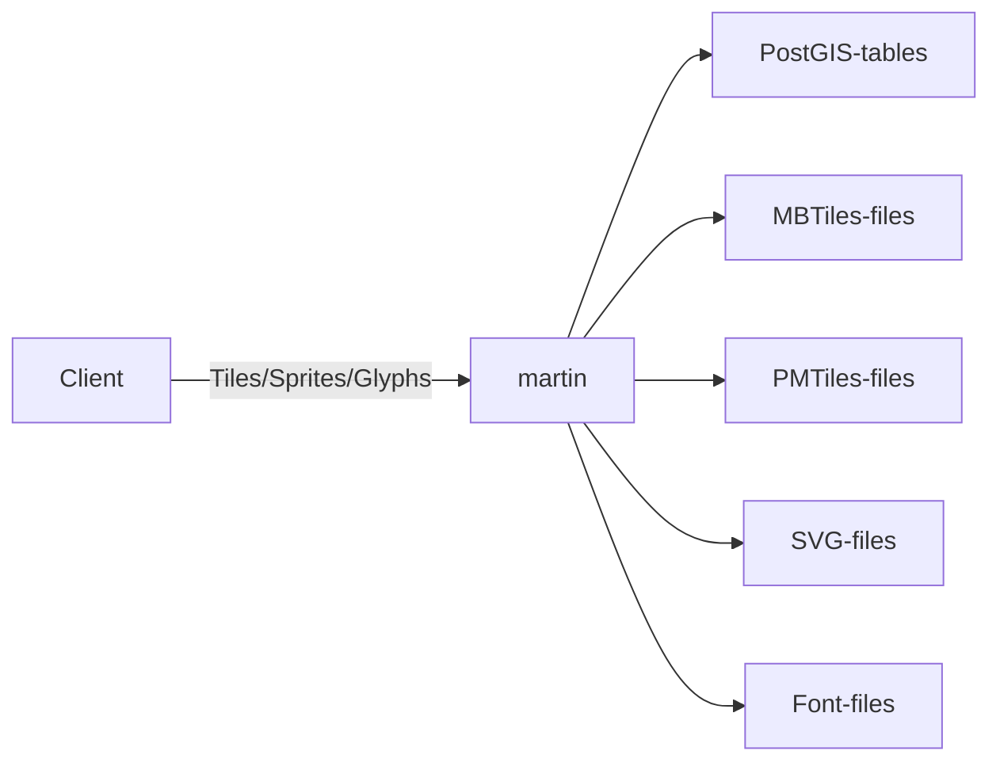

# martin-starter

- The starter for [Martin Tile server](https://github.com/maplibre/martin).
- To demonstrate features of Martin: serving MVT from PostGIS/MBTiles/PMTiles and SVG sprites.

## usage

This starter is built to run with Docker compose v2.

```sh
cd martin-starter
docker compose up -d
```

Then, you can access the app at http://localhost

- catalog: `http://localhost/martin/catalog`
- sprite: `http://localhost/martin/sprite/maki[.png|.json]`

## diagram



## servers

- Nginx: serving static files and reverse proxy to Martin
- Martin
- PostGIS

## data

- /martin/maki: https://github.com/mapbox/maki
- /martin/font/azukiP.ttf: http://azukifont.com/
- /postgis-init/02-spatial_data.sql: 任意の3次元の点を追加
